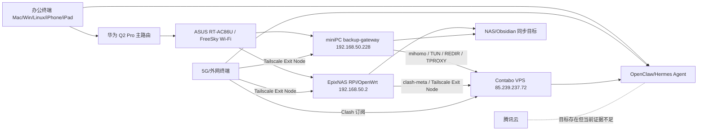

# 00 现状审计报告（AS-IS）

审计对象：`/Users/epix/Dev/TraeDev/contabo`。  
目标依据：`/Users/epix/Dev/TraeDev/contabo/network-audit-2026Q2/多设备统一网络管理项目配置情况及功能目标.md`。  
审计范围：`network-audit-2026Q2/` 下文档、脚本、配置、`bench/`、`results/`、`mobile-compare/`、`fingerprints/`、`subscription-hits/`，以及仓库入口 `README.md` 与 `sync_to_github.sh`。本报告只做现状分析，不代表已经执行线上变更。

## 1. 问题与风险优先结论

### P0：移动端与订阅链的“已闭环”结论证据不足

- `P0_EXECUTION_LOG_2026-04-20.md` 记录移动场景证据链“已补齐”，但当前 `results/` 实际只发现 `network-audit-2026Q2/results/manual_20260421_120408/iphone/iphone_speedtest_template.csv`，没有日志中列出的 `raw/` 与 `segments/` 文件。
- `mobile-compare/manual_20260421_120408/compare_result.json` 的 `bottleneck_hint.value` 为 `insufficient_data`，各 5G 场景有效下载、上传、ping、jitter 样本数均为 0。
- `SUBSCRIPTION_RELEASE_MANIFEST_2026-04-20.md` 证明 canonical 订阅文件有 SHA-256 和静态规则覆盖校验，但 `subscription-hits/` 只有 `hits.csv.template`，缺少 Mac/iPhone 客户端真实命中日志。
- 影响：5G/外网访问、Tailscale Exit Node、Clash 订阅链路无法被运营侧封板为“真实可交付能力”。

证据路径：
- `/Users/epix/Dev/TraeDev/contabo/network-audit-2026Q2/P0_EXECUTION_LOG_2026-04-20.md`
- `/Users/epix/Dev/TraeDev/contabo/network-audit-2026Q2/results/manual_20260421_120408/iphone/iphone_speedtest_template.csv`
- `/Users/epix/Dev/TraeDev/contabo/network-audit-2026Q2/mobile-compare/manual_20260421_120408/compare_result.json`
- `/Users/epix/Dev/TraeDev/contabo/network-audit-2026Q2/SUBSCRIPTION_RELEASE_MANIFEST_2026-04-20.md`
- `/Users/epix/Dev/TraeDev/contabo/network-audit-2026Q2/subscription-hits/hits.csv.template`

### P0：生产级凭据与配置边界未收敛

- `README.md` 与 `CURRENT_SOURCE_OF_TRUTH.md` 明确要求凭据只进入 `secrets/`，但 `configs/sing-box-config.deploy.json`、`configs/sing-box-config.tuned.json`、`configs/clash-subscription*.yaml` 中仍存在可复用认证材料形态，例如 Reality 私钥、UUID、HY2 密码、证书路径、订阅节点凭据字段。
- `sync_to_github.sh` 有二次拦截 `secrets/` 与 `_archive_legacy_2026-04-20/`，但没有对 `network-audit-2026Q2/configs/` 内的代理凭据做 secret 扫描门禁。
- 影响：一旦把正式产物推送到远端或交给多 Agent 协作，可能发生节点凭据泄漏、订阅滥用或生产代理入口暴露。

证据路径：
- `/Users/epix/Dev/TraeDev/contabo/README.md`
- `/Users/epix/Dev/TraeDev/contabo/network-audit-2026Q2/CURRENT_SOURCE_OF_TRUTH.md`
- `/Users/epix/Dev/TraeDev/contabo/network-audit-2026Q2/configs/sing-box-config.deploy.json`
- `/Users/epix/Dev/TraeDev/contabo/network-audit-2026Q2/configs/sing-box-config.tuned.json`
- `/Users/epix/Dev/TraeDev/contabo/network-audit-2026Q2/configs/clash-subscription.runtime-safe.yaml`
- `/Users/epix/Dev/TraeDev/contabo/network-audit-2026Q2/configs/clash-subscription.tuned.yaml`
- `/Users/epix/Dev/TraeDev/contabo/sync_to_github.sh`

### P1：事实源“入口已统一”，但运行态字段仍不完整

- `CURRENT_SOURCE_OF_TRUTH.md` 已定义单一入口和后续新增产物规则，`network_facts.env` 也把 LAN、miniPC、EpixNAS、VPS 的 IP/端口集中起来。
- 但 `network_facts.env` 中 `TAILSCALE_BACKUP_GW_IP` 与 `TAILSCALE_EPIXNAS_IP` 仍为空，Tailscale Exit Node 的运营事实未完全固化。
- `README.md` 快速入口引用 `network-audit-2026Q2/NETWORK_TOPOLOGY.md`，但当前审计文件清单没有发现该文件，入口文档存在悬空引用风险。
- 影响：脚本可参数化，但 Tailscale 运营、巡检、交接仍可能回到人工口头事实。

证据路径：
- `/Users/epix/Dev/TraeDev/contabo/network-audit-2026Q2/CURRENT_SOURCE_OF_TRUTH.md`
- `/Users/epix/Dev/TraeDev/contabo/network-audit-2026Q2/network_facts.env`
- `/Users/epix/Dev/TraeDev/contabo/README.md`

### P1：脚本与线上路径存在“双源”风险

- `systemd/mihomo-exitnode-rules.service` 固定从 `/opt/contabo/network-audit-2026Q2/apply_exitnode_rules_safe.sh` 执行。
- `openwrt/etc-init.d-mihomo-exitnode` 固定从 `/root/contabo/network-audit-2026Q2/apply_exitnode_rules_safe.sh` 执行。
- `CURRENT_SOURCE_OF_TRUTH.md` 又记录 miniPC 现场生效脚本位于 `/usr/local/sbin/ensure-mihomo-lan-hooks.sh`，现场生效服务为 `/etc/systemd/system/mihomo-lan-hooks.service`。
- 影响：仓库脚本、部署路径、现场固化脚本并存，后续变更可能“改了仓库但线上未生效”或“线上修复未回写仓库”。

证据路径：
- `/Users/epix/Dev/TraeDev/contabo/network-audit-2026Q2/systemd/mihomo-exitnode-rules.service`
- `/Users/epix/Dev/TraeDev/contabo/network-audit-2026Q2/openwrt/etc-init.d-mihomo-exitnode`
- `/Users/epix/Dev/TraeDev/contabo/network-audit-2026Q2/CURRENT_SOURCE_OF_TRUTH.md`

### P1：Batch1 已证明 miniPC 金丝雀路径可达，但仍处于观察/扩围前阶段

- `BATCH1_MINIPC_CANARY_CHANGE_ORDER_2026-04-22.md` 记录 mac、Windows、Mobile 三台金丝雀通过，`CURRENT_SOURCE_OF_TRUTH.md` 也记录 Batch1 完成并进入观察期。
- `BATCH1_24H_OBSERVATION_CHECKLIST_2026-04-23.md` 要求 24h 内至少 6 个 checkpoint，但当前只看到 Checkpoint-01 的两份 bench 样本。
- 影响：可以证明“局部可达”，不能证明“全家网稳定迁移”。

证据路径：
- `/Users/epix/Dev/TraeDev/contabo/network-audit-2026Q2/BATCH1_MINIPC_CANARY_CHANGE_ORDER_2026-04-22.md`
- `/Users/epix/Dev/TraeDev/contabo/network-audit-2026Q2/BATCH1_24H_OBSERVATION_CHECKLIST_2026-04-23.md`
- `/Users/epix/Dev/TraeDev/contabo/network-audit-2026Q2/CURRENT_SOURCE_OF_TRUTH.md`
- `/Users/epix/Dev/TraeDev/contabo/network-audit-2026Q2/bench/20260422T173530Z/pc_direct.json`
- `/Users/epix/Dev/TraeDev/contabo/network-audit-2026Q2/bench/20260422T173609Z/remote_clash.json`

### P2：性能基线可用，但指标体系不足以支撑产品级决策

- `bench_throughput.sh` 能产生 `pc_direct` 与 `remote_clash` JSON，且 2026-04-22 门禁复测与后置采样均为有效 HTTP 200。
- 但 `speedtest_present` 均为 false，bench 只覆盖当前主机 `epix`，没有设备维度、网络维度、订阅版本维度、Exit Node 维度的一致字段。
- `fingerprints/epix/20260421T215802Z_baseline-local/fingerprint.sha256` 是空内容哈希，不能证明真实 iptables/nft 规则基线。
- 影响：能做局部排障，不能支撑可审计的长期运营看板。

证据路径：
- `/Users/epix/Dev/TraeDev/contabo/network-audit-2026Q2/bench_throughput.sh`
- `/Users/epix/Dev/TraeDev/contabo/network-audit-2026Q2/bench/20260422T022825Z/pc_direct.json`
- `/Users/epix/Dev/TraeDev/contabo/network-audit-2026Q2/bench/20260422T022911Z/remote_clash.json`
- `/Users/epix/Dev/TraeDev/contabo/network-audit-2026Q2/bench/20260422T115053Z/pc_direct.json`
- `/Users/epix/Dev/TraeDev/contabo/network-audit-2026Q2/bench/20260422T115133Z/remote_clash.json`
- `/Users/epix/Dev/TraeDev/contabo/network-audit-2026Q2/fingerprints/epix/20260421T215802Z_baseline-local/fingerprint.sha256`

## 2. 设备与角色矩阵

### 终端层

- Mac、Windows 11、Linux 笔记本：目标是办公 LAN 与外网场景都能获得全球访问能力，并作为 Obsidian 与 Agent 协同终端。证据：`多设备统一网络管理项目配置情况及功能目标.md`。
- iPhone、安卓手机、iPad：目标是在 5G/外网通过 Clash 订阅或 Tailscale Exit Node 访问全球网络与家网服务。证据：`多设备统一网络管理项目配置情况及功能目标.md`、`MOBILE_MEASUREMENT_RUNBOOK_2026-04-20.md`。

### 路由与边缘层

- 华为 Q2 Pro 主路由：办公环境网络主入口，负责基础网络分发。证据：`多设备统一网络管理项目配置情况及功能目标.md`。
- ASUS RT-AC86U / FreeSky：下挂路由与 Wi-Fi 接入，当前 Batch1 与 Freesky 场景都围绕其 DHCP、默认网关、策略路由展开。证据：`BATCH1_MINIPC_CANARY_CHANGE_ORDER_2026-04-22.md`、`asus/policy_route_vps_bypass.md`。
- backup-gateway / miniPC（`192.168.50.228`）：家庭代理主网关、Tailscale Exit Node、透明代理执行面、Batch1 金丝雀目标网关。证据：`NETWORK_GLOBAL_AUDIT_DIFF_REPORT_2026-04-20_v1.md`、`network_facts.env`、`BATCH1_MINIPC_CANARY_CHANGE_ORDER_2026-04-22.md`。
- EpixNAS / 树莓派（`192.168.50.2`）：OpenWrt、备用 Exit Node、本地服务/NAS 角色。证据：`NETWORK_GLOBAL_AUDIT_DIFF_REPORT_2026-04-20_v1.md`、`network_facts.env`。

### 云与控制面

- Contabo VPS（`85.239.237.72`）：VLESS Reality、HY2、订阅发布、AI/WARP 出口策略、远程入口控制面。证据：`P2_ROOT_CAUSE_ANALYSIS_2026-04-20.md`、`configs/sing-box-config.deploy.json`、`SUBSCRIPTION_RELEASE_MANIFEST_2026-04-20.md`。
- 腾讯云服务器：原始目标中作为生产环境和测试环境发布应用与网站，但当前 `network-audit-2026Q2/` 未见具体部署、健康检查或拓扑证据。证据：`多设备统一网络管理项目配置情况及功能目标.md`。

## 3. 当前组网拓扑（As-Is）

关键判断：
- LAN 侧 miniPC 已通过 Batch1 金丝雀证明可承接至少 3 台样本。证据：`BATCH1_MINIPC_CANARY_CHANGE_ORDER_2026-04-22.md`。
- 全局 DHCP 默认网关切换仍未完成，ASUS UI 不支持按设备网关，Path B 有较大影响面。证据：`BATCH1_MINIPC_CANARY_CHANGE_ORDER_2026-04-22.md`。
- 外网/5G 的 Tailscale Exit Node 真实速率归因仍未完成。证据：`mobile-compare/manual_20260421_120408/compare_result.json`。
- NAS/Obsidian 与多 Agent 协同是目标能力，但当前审计目录没有 Syncthing/WebDAV/Obsidian vault、OpenClaw/Hermes 部署与健康检查证据。证据：`多设备统一网络管理项目配置情况及功能目标.md`。

## 4. 已实现、未实现、伪实现能力

### 已实现能力

- 单一审计目录与事实源入口已建立：`network-audit-2026Q2/README.md`、`CURRENT_SOURCE_OF_TRUTH.md`。
- Exit Node 规则下发入口具备平台识别与拒绝 unknown 平台能力：`apply_exitnode_rules_safe.sh`。
- Armbian 与 OpenWrt 自恢复工件存在：`systemd/mihomo-exitnode-rules.service`、`openwrt/etc-init.d-mihomo-exitnode`。
- 性能采集脚本能产出 JSON 基线并规避宿主代理变量污染：`bench_throughput.sh`。
- miniPC 金丝雀路径完成 mac + Windows + mobile 3 台样本可达性验证：`BATCH1_MINIPC_CANARY_CHANGE_ORDER_2026-04-22.md`、后置 bench 文件。
- Clash 与 sing-box 调优候选配置存在，覆盖 TFO、smux、sniffer、fallback、HY2 带宽提示等：`configs/clash-subscription.tuned.yaml`、`configs/sing-box-config.tuned.json`。

### 未实现能力

- 5G/iPhone 四场景测速矩阵未补齐，移动瓶颈归因未完成：`results/manual_20260421_120408/iphone/iphone_speedtest_template.csv`、`mobile-compare/manual_20260421_120408/compare_result.json`。
- 客户端订阅命中验收没有真实日志或截图归档：`subscription-hits/hits.csv.template`。
- Tailscale IP、Exit Node 真实设备状态未进入 `network_facts.env`：`network_facts.env`。
- NAS/Obsidian 同步没有具体服务配置、同步策略、冲突处理、恢复演练证据：`多设备统一网络管理项目配置情况及功能目标.md`。
- OpenClaw/Hermes Agent 协同没有部署拓扑、认证、端口、任务流、故障隔离证据：`多设备统一网络管理项目配置情况及功能目标.md`。
- 腾讯云生产/测试环境没有纳入统一巡检、资产、变更与回滚模型：`多设备统一网络管理项目配置情况及功能目标.md`。

### 伪实现能力

- “P0 仓库层 PASS”不等于“线上运营 PASS”：`P0_COMPLETION_REPORT_2026-04-20.md` 明确仍需 iPhone CSV 与 Clash 命中补录。
- “P1 工具已贯通”不等于“现场已安装”：`P1_EXECUTION_LOG_2026-04-20.md` 多处标注线上需维护窗口执行。
- “P2 配置已闭环”不等于“全场景性能已达标”：`P2_EXECUTION_LOG_2026-04-20.md` 明确剩余在机事项包括 VPS、ExitNode、ASUS、客户端导入、移动实测。
- “Batch1 完成”不等于“Batch2 可直接扩围”：`BATCH1_24H_OBSERVATION_CHECKLIST_2026-04-23.md` 要求 24h 稳定观察。

## 5. 反复问题与失败模式复盘

- 路径漂移：旧文档提到历史目录与诊断目录，当前正式目录又有 `network-audit-2026Q2/`；`P0_EXECUTION_LOG_2026-04-20.md` 中的部分 `results/` 文件当前未落在审计目录。
- 事实源不统一：`CURRENT_SOURCE_OF_TRUTH.md` 已补救，但 `README.md` 仍引用未发现的 `NETWORK_TOPOLOGY.md`，`network_facts.env` Tailscale 字段为空。
- 脚本与文档不一致：systemd、procd、现场 `/usr/local/sbin` 固化脚本并存，容易形成仓库与线上双源。
- 验证闭环不完整：订阅有静态覆盖校验，但缺真实客户端命中；移动端有 CSV 模板与 compare 输出，但缺有效数据。
- 回滚闭环局部完整、全局不足：Exit Node、ASUS、订阅都有回滚入口，但缺少“统一变更记录 + 证据包 + 决策门禁”的产品化机制。
- 测量污染曾发生：`P2_EXECUTION_LOG_2026-04-20.md` 记录 remote_clash 403 被定位为宿主代理变量污染，之后 `bench_throughput.sh` 增加 unset proxy 变量。

## 6. 审计结论

当前项目已经从“散乱排障材料”推进到“有单一审计目录、有脚本、有 runbook、有金丝雀流程”的阶段，但仍不是可长期交接运营的产品。核心短板不是单个网络参数，而是缺少一个本地部署控制台，把资产事实、阶段执行、门禁、证据归档、回滚与报告强制串成闭环。

因此，下一阶段不应继续手工追加零散脚本，而应建设一个本地部署控制台产品：以 `network-audit-2026Q2/` 现有脚本和配置为被编排对象，统一管理设备、阶段、证据、门禁、回滚、报告与审计。该产品的 SRD、定位与开发级 PRD 见后续文档。
