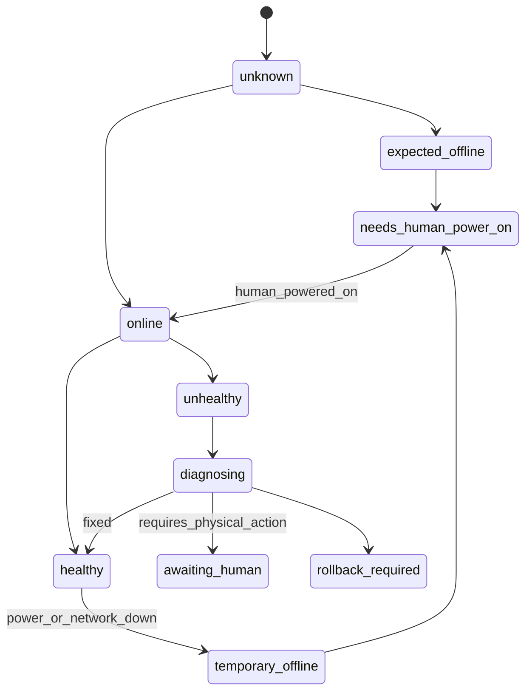
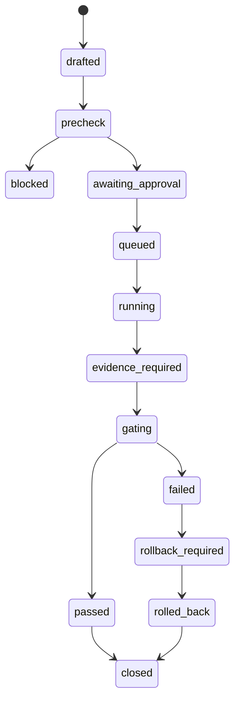
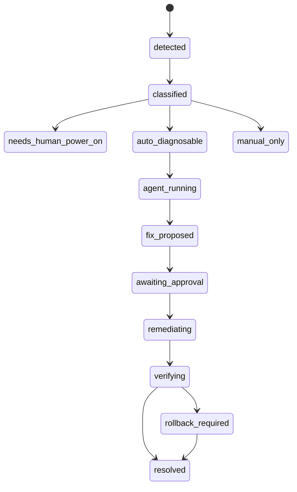
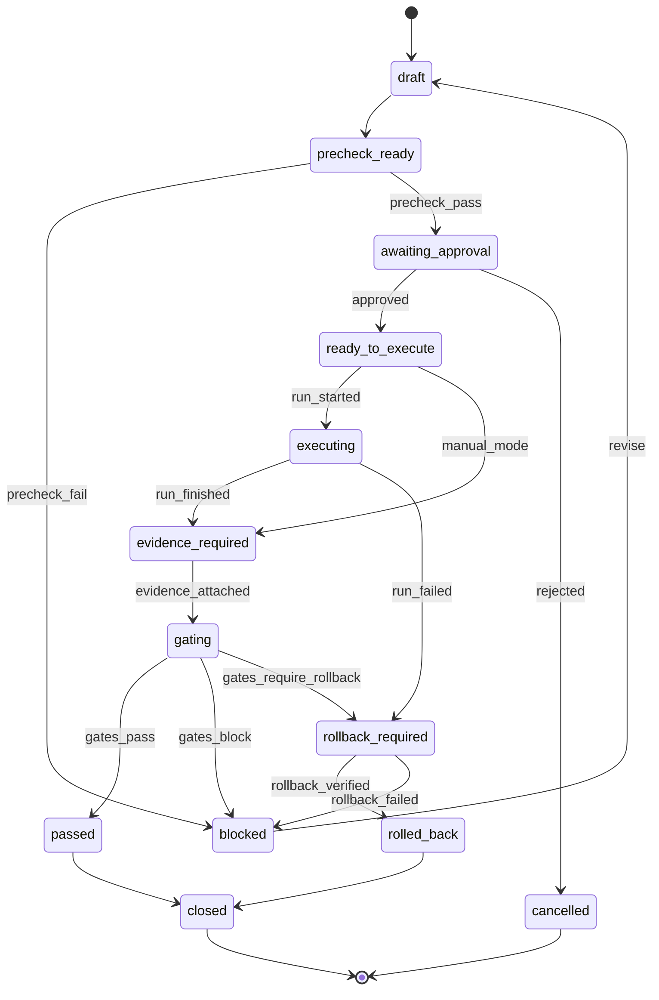
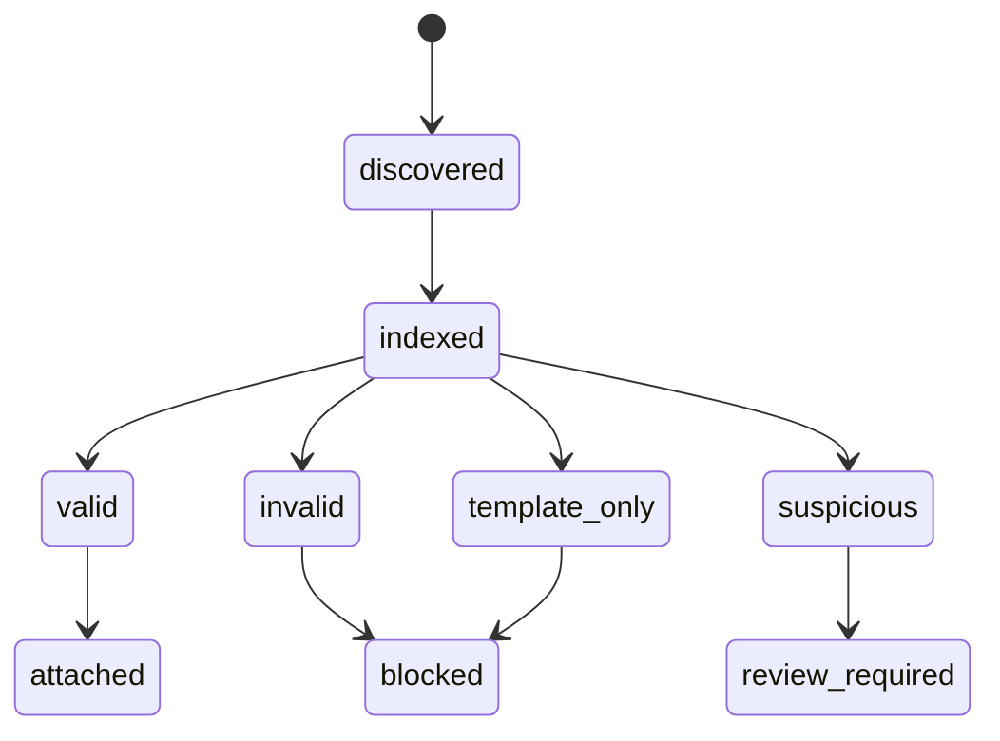
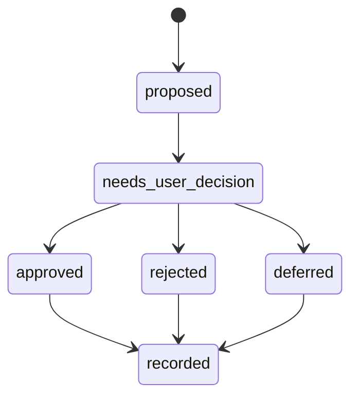

# 03 PRD UniNode Ops Console

产品定位：面向个人/小团队复杂本地网络的可视化运维控制台，集成设备事实源、网络拓扑、全球访问链路、Tailscale 组网、NAS/Obsidian 服务、多 Agent 协作、Cursor 自动化检查、故障处理与可回滚执行。

版本：v0.2 修订版。  
修订依据：用户新增意见、现有 `network-audit-2026Q2/` 事实、同类产品调研。

## 1. 问题与风险先行

现有项目已经具备大量脚本、配置、runbook 和阶段记录，但它仍然不是一个可持续运营系统。当前最大风险不是某个设备短时离线，而是缺少一个能把“设备应该是什么、当前事实是什么、下一步该做什么、出了问题如何回滚、Agent 能自动处理什么”统一起来的控制台。

关键风险：

- 设备在线状态不能被当作永久事实。miniPC、树莓派、手机、NAS 或 VPS 的短时断电/下线应被识别为 `offline_pending_human_power_on`，而不是直接判定架构失败。
- 证据链仍有缺口。移动端 5G、订阅命中、规则指纹、Batch1 观察均需要更强的机器可读状态，而不是散落在 Markdown。
- 配置与凭据边界必须升级。当前代理配置、诊断脚本、VPS 配置存在生产级敏感字段形态，控制台必须默认脱敏、隔离、扫描。
- 当前 runbook 是人读的，Agent 自动化需要结构化任务、权限、审批、执行结果和失败恢复机制。
- 产品范围必须从“网络排障脚本集合”升级为“本地运维平台”，但不能一次性替代 Tailscale、Clash、NAS、OpenClaw、Hermes 或 Cursor 本身。

## 2. 同类产品调研结论

调研对象包括：

- Netdata：强调零配置发现、实时指标、日志/进程/网络连接统一可视化、节点本地处理。
- Uptime Kuma：强调自托管、易用 UI、HTTP/TCP/Ping/DNS 等可用性监控、通知和状态页。
- OpenWISP：强调网络设备控制器、OpenWrt Agent、拓扑、配置下发、监控与 VPN 自动化。
- Headscale / Headplane / headscale-admin：强调自托管 Tailscale 控制面和 Web UI，管理节点、ACL、路由、DNS、auth key。
- Rundeck：强调 Web UI + CLI/API 的 runbook 自动化、节点资源模型、权限、审计日志、密钥库。
- StackStorm：强调事件驱动自动化、传感器、规则、动作、自动修复和 ChatOps。
- Home Assistant Tailscale integration：强调设备在线状态、Tailnet 健康、Key 过期、设备可达性，并可触发自动化。
- Obsidian self-hosted LiveSync/CouchDB + Tailscale 项目：强调通过私有 tailnet 暴露同步服务，跨设备同步且不公开到公网。

UniNode 不直接复制任何一个产品。落地策略是：

- 像 Netdata/Uptime Kuma 一样，把健康、延迟、可达性、服务状态做成可视化首页。
- 像 Rundeck/StackStorm 一样，把现有脚本和 runbook 变成可审批、可审计、可回滚的 Job/Workflow。
- 像 Headscale 管理面一样，把 Tailscale 节点、Exit Node、ACL、路由、key 作为一等对象。
- 像 OpenWISP 一样，对 OpenWrt/路由/旁路由建立设备模型、配置模型与变更模型。
- 像 Home Assistant 一样接受“设备临时离线是正常状态”，用自动化规则和人工提示协作处理。
- 像 Obsidian LiveSync 自托管方案一样，把 NAS/Obsidian 服务作为 tailnet 内服务治理对象，而不是公网暴露服务。

## 3. 产品目标

### 一句话目标

UniNode Ops Console 是一个本地优先的可视化网络运维控制台，用 Agent 自动化把多设备网络、全球访问、Tailscale、NAS/Obsidian 与多智能体协作变成可检查、可配置、可故障处理、可回滚、可持续运营的系统。

### 用户成功标准

- 打开控制台能看到“当前网络是否可用、哪些设备离线、哪些离线需要人工开机、哪些是真故障”。
- 能一键运行 Cursor/Agent 自动化检查，生成结构化问题清单、证据路径和修复建议。
- 能按阶段执行全球访问链路检查：Freesky/旁路由、VPS 订阅、Tailscale Exit Node、NAS/Obsidian、Agent 协作。
- 能把现有脚本转换成审批式 Job：预检、执行、门禁、证据、回滚、报告。
- 能让 OpenClaw/Hermes/Cursor Agent 在同一事实源下协作，不再引用错路径或把模板当证据。

## 4. 产品边界

### In Scope

- 可视化控制台：Dashboard、拓扑图、设备页、服务页、任务页、证据页、故障页、报告页。
- 设备事实源：华为主路由、ASUS/FreeSky、miniPC、树莓派/EpixNAS、Contabo VPS、腾讯云、Mac/Windows/Linux/iPhone/iPad/Android。
- 全球访问链路：旁路由透明代理、ASUS/FreeSky 路径、VPS VLESS/HY2 订阅、Clash/mihomo 客户端、Tailscale Exit Node。
- Tailscale 组网：节点在线、Exit Node、Subnet Route、ACL/key 到期、服务可达性。
- NAS/Obsidian：NAS 服务、同步服务、CouchDB/LiveSync 或 WebDAV/Syncthing 类型服务的健康、备份、恢复、冲突风险。
- OpenClaw/Hermes Agent 协作：Agent 节点注册、在线状态、能力标签、任务分发入口、跨设备连通性检查。
- Cursor 自动化：在控制台内定义检查任务、配置任务、故障处理任务，并把执行交给 Cursor/Agent 或本地执行器。
- 故障处理：检测、分类、建议、自动化 runbook、人工开机提示、回滚与复测。
- 安全治理：secret 扫描、脱敏、审批、执行权限、审计日志。

### Out of Scope

- 不替代 Tailscale 官方控制面或 Headscale。
- 不替代 Clash/mihomo/sing-box 的底层代理能力。
- 不直接刷路由器固件。
- 不默认自动点击 ASUS 管理 UI。
- 不默认执行破坏性网络命令。
- 不在 MVP 做完整 Agent 调度平台，只做网络运维协作层。
- 不要求所有设备长期在线；离线设备可进入人工接通状态。

## 5. 核心信息架构

### Dashboard

展示：

- 全局健康分：网络、Tailscale、VPS、NAS、Agent、证据链、安全。
- 当前 P0/P1/P2 风险。
- 离线设备与原因分类：临时断电、网络不可达、凭据失效、服务故障。
- 需要人工动作：开机、接电、确认变更、补录测速、刷新订阅。
- 最近自动化任务：成功、失败、等待审批、需要回滚。

### Topology

展示：

- 物理拓扑：华为主路由 → ASUS/FreeSky → miniPC/EpixNAS → 终端。
- 逻辑拓扑：Tailscale tailnet、Exit Node、VPS、腾讯云、NAS 服务、Agent 节点。
- 流量路径：办公 LAN 全球访问、5G 外网访问、Clash 订阅、Obsidian 同步、Agent 通信。
- 状态叠层：在线/离线、服务健康、路径延迟、配置漂移、证据有效性。

### Devices

管理：

- 设备角色、IP、Tailscale IP、服务端口、所在网络、供电状态、人工接通说明。
- 设备在线状态不等于配置正确，配置正确也不要求设备此刻在线。
- 支持 `expected_offline`、`temporary_power_off`、`needs_human_power_on`、`online_unhealthy`。

### Services

服务类型：

- VPS VPN/订阅服务：sing-box、VLESS、HY2、订阅发布。
- 旁路由服务：mihomo/clash-meta、TUN、REDIR、TPROXY、DNS。
- Tailscale 服务：tailscaled、Exit Node、Subnet Route、ACL/key。
- NAS/Obsidian：WebDAV、Syncthing、CouchDB/LiveSync、备份任务。
- Agent：OpenClaw、Hermes、Cursor Agent helper。

### Automation

对象：

- Check：只读检查。
- Configure：生成配置或执行受控配置。
- Diagnose：分段诊断。
- Repair：已知故障自动处理。
- Rollback：回滚与复测。
- Report：报告与交接包。

### Evidence

统一索引：

- bench JSON、mobile compare、subscription hits、fingerprints、日志、截图、人工确认、Agent 输出。
- 每份证据都有 validity：valid、invalid、template_only、missing、stale、requires_human_collection。

### Reports

生成：

- 当前态报告。
- 变更单。
- 故障复盘。
- 运营日报/周报。
- Agent 上下文包。
- 开发任务执行报告。

## 6. 关键用户流程

### Flow 1：初始化导入

1. 用户运行 `uninode init`。
2. 系统导入现有 `network-audit-2026Q2/`、`Docs/`、脚本、配置、bench、mobile、fingerprints。
3. 系统识别设备、服务、脚本、证据、风险。
4. 系统生成初始拓扑和阻塞清单。

成功标准：

- 不因设备离线而失败。
- 只把离线设备标记为需要人工接通或等待检查。
- 所有敏感字段默认脱敏。

### Flow 2：全球访问健康检查

覆盖：

- 办公 LAN → ASUS/FreeSky → miniPC 旁路由 → VPS。
- 外网/5G → Clash 订阅 → VPS。
- 外网/5G → Tailscale Exit Node → miniPC/EpixNAS → VPS。

步骤：

1. 检查 VPS 监听与订阅文件。
2. 检查旁路由服务状态。
3. 检查 Tailscale 节点状态，离线设备可提示人工开机。
4. 运行 bench 或生成人工手机测速任务。
5. 生成结论：可用、降级、证据不足、需人工接通、需回滚。

### Flow 3：NAS/Obsidian 同步健康检查

覆盖：

- NAS 存储可达性。
- 同步服务状态。
- Tailscale 内网访问。
- 手机/电脑访问路径。
- 最近备份与恢复点。

MVP 不强制指定技术路线，但必须支持建模：

- WebDAV。
- Syncthing。
- CouchDB + Obsidian LiveSync。

### Flow 4：OpenClaw/Hermes Agent 协作检查

检查：

- Agent 节点是否注册。
- 节点能否通过 tailnet 互相访问。
- 任务分发端口/队列是否可达。
- Agent 是否拿到当前 `agent_context`。
- 是否存在凭据、路径、事实源漂移风险。

### Flow 5：Cursor 自动化故障处理

1. 控制台发现故障或用户点击“诊断”。
2. 生成结构化任务：目标、约束、证据、禁止动作、需要人工确认点。
3. Cursor Agent 执行只读检查或生成修复计划。
4. 控制台接收 Agent 输出，归档为 evidence。
5. 若需要执行配置，进入审批。
6. 执行后跑 gate 与 rollback readiness。

## 7. 状态机设计

### Device 状态



### Automation Job 状态



### Incident 状态



## 8. 模块设计

### Frontend Console

建议技术：React + TypeScript + Vite 或 Next.js。  
职责：

- Dashboard、拓扑图、任务流、证据浏览、报告预览。
- WebSocket/SSE 接收任务事件。
- 显示 Agent 执行过程与审批按钮。

### API Server

建议技术：Python FastAPI 或 Node.js NestJS。  
职责：

- 设备/服务/任务/证据/报告 API。
- Job 编排。
- 权限、审批、审计。
- 调用执行器与 Agent Bridge。

### Local Agent Runner

职责：

- 在本机执行只读检查。
- 受控执行白名单脚本。
- 收集 stdout/stderr/exit code。
- 统一超时、重试、取消。

### Cursor Automation Bridge

职责：

- 生成 Cursor Agent 任务包。
- 约束 Agent 可读文件、禁止动作、输出格式。
- 接收 Agent 结果并转成 evidence。
- 支持人工确认后再进入执行。

### Integrations

首批集成：

- Tailscale API / CLI。
- Clash/mihomo controller API。
- sing-box health。
- SSH 只读探测。
- NAS 服务探测。
- Obsidian sync service check。
- Git/Cursor workspace check。

### Evidence Store

职责：

- 统一保存证据元数据。
- 不复制敏感文件，保存路径引用和脱敏摘要。
- 支持证据有效性、过期、模板识别。

### Policy Engine

职责：

- 执行门禁。
- 决定是否允许 Agent 自动处理。
- 决定是否需要人工开机/接线/审批。

## 9. CLI 与控制台命令设计

CLI 名称：`uninode`。

```bash
uninode init --source /Users/epix/Dev/TraeDev/contabo --workspace /Users/epix/Dev/UniNode
uninode console start
uninode scan all
uninode scan devices
uninode scan tailscale
uninode scan services
uninode scan evidence
uninode check global-access
uninode check obsidian-sync
uninode check nas
uninode check agents
uninode incident open --type global-access-slow
uninode job run batch1-observation --dry-run
uninode agent task diagnose-global-access --provider cursor
uninode report current --out Docs/current_ops_report.md
```

Web 控制台提供同等能力。

## 10. 数据模型

### Device

- id
- name
- type
- role
- ip_lan
- ip_tailscale
- expected_online
- power_state_assumption
- human_action
- services
- tags
- source_paths

### Service

- id
- device_id
- type
- endpoint
- health_check
- dependencies
- expected_status
- last_status
- runbook_refs

### AutomationJob

- id
- name
- category
- mode: readonly | dry_run | approved_execute | manual_handoff
- target_devices
- prechecks
- actions
- gates
- rollback
- evidence_required
- approval
- agent_provider

### Incident

- id
- severity
- domain: global_access | tailscale | nas | obsidian | agent | security
- symptoms
- classification
- auto_actions_allowed
- human_actions
- evidence
- status

### Evidence

- id
- type
- source_path
- summary
- validity
- collected_by
- collected_at
- related_job
- related_incident
- redaction_applied

### AgentTask

- id
- provider: cursor | openclaw | hermes | local
- prompt
- constraints
- allowed_paths
- denied_actions
- expected_output_schema
- result_evidence_id

## 11. 配置设计

### `app.yaml`

```yaml
version: 1
mode: local_first
workspace: /Users/epix/Dev/UniNode
source_root: /Users/epix/Dev/TraeDev/contabo
ui:
  host: 127.0.0.1
  port: 43110
execution:
  default_mode: dry_run
  require_approval_for_network_changes: true
  allow_auto_readonly_checks: true
agent_automation:
  cursor:
    enabled: true
    default_mode: readonly
  openclaw:
    enabled: false
  hermes:
    enabled: false
security:
  redact_secrets: true
  block_publish_on_secret_findings: true
```

### `devices.yaml`

```yaml
devices:
  - id: huawei_main_router
    name: Huawei Q2 Pro
    type: router
    role: office_primary_entry
    expected_online: true

  - id: asus_freesky
    name: ASUS RT-AC86U / FreeSky
    type: router
    role: lan_dhcp_wifi_policy_route
    ip_lan: 192.168.50.1
    expected_online: true

  - id: minipc_gateway
    name: backup-gateway miniPC
    type: edge_node
    role: transparent_gateway_tailscale_exit_nas_candidate
    ip_lan: 192.168.50.228
    expected_online: false
    power_state_assumption: may_be_temporarily_powered_off
    human_action: power_on_if_check_required

  - id: epixnas_rpi
    name: EpixNAS Raspberry Pi
    type: edge_node
    role: nas_backup_exit_node
    ip_lan: 192.168.50.2
    expected_online: false
    power_state_assumption: may_be_temporarily_powered_off
    human_action: power_on_if_check_required

  - id: contabo_vps
    name: Contabo VPS
    type: vps
    role: vpn_subscription_public_exit
    ip_public: 85.239.237.72
    expected_online: true
```

### `automations.yaml`

```yaml
automations:
  - id: check_global_access
    category: check
    mode: readonly
    targets: [asus_freesky, minipc_gateway, epixnas_rpi, contabo_vps]
    allow_offline_targets: true
    offline_policy: mark_needs_human_power_on
    steps:
      - check_vps_listeners
      - check_subscription_manifest
      - check_mihomo_health
      - check_tailscale_status
      - run_bench_if_local_path_available
    gates:
      - no_invalid_json
      - no_na_for_required_bench
      - subscription_has_live_hits_or_mark_evidence_gap

  - id: diagnose_obsidian_sync
    category: diagnose
    mode: readonly
    targets: [epixnas_rpi, minipc_gateway]
    allow_offline_targets: true
    steps:
      - check_tailscale_service_reachability
      - check_sync_endpoint
      - check_recent_backup_marker
```

## 12. 可视化页面要求

### 首页 Dashboard

必须包含：

- 全局健康卡片。
- 设备在线/离线/需人工开机。
- 全球访问链路状态。
- Tailscale Tailnet 状态。
- NAS/Obsidian 状态。
- Agent 协作状态。
- 安全风险。
- 最新自动化任务。

### 拓扑页

必须支持：

- 物理层和逻辑层切换。
- 点击边查看证据。
- 显示临时离线与真实故障差异。
- 标记关键路径：Freesky、VPS、Exit Node、NAS sync、Agent bus。

### 自动化页

必须支持：

- Job 列表。
- Cursor 自动化任务入口。
- dry-run 预览。
- 审批按钮。
- 实时日志。
- 回滚入口。

### 故障页

必须支持：

- 故障分类。
- 建议动作。
- 自动化处理状态。
- 人工动作步骤。
- 证据与报告。

## 13. 安全与权限

- 默认只读。
- 所有生产配置动作需要审批。
- 所有 destructive 或网络中断风险动作默认禁止自动执行。
- Secret 扫描覆盖 YAML、JSON、Shell、Markdown。
- Agent 任务包必须脱敏。
- 审计日志 append-only。
- 凭据不进入 Git、不进入报告、不进入 Agent 上下文。

## 14. 错误处理

错误分类：

- `DEVICE_OFFLINE_EXPECTED`：设备可能临时断电，提示人工开启。
- `DEVICE_OFFLINE_UNEXPECTED`：应在线设备不可达。
- `EVIDENCE_MISSING`：证据缺失。
- `EVIDENCE_TEMPLATE_ONLY`：只有模板。
- `CONFIG_DRIFT`：配置漂移。
- `SECRET_RISK`：敏感信息风险。
- `AGENT_ACTION_BLOCKED`：Agent 请求越权。
- `ROLLBACK_REQUIRED`：需要回滚。

每个错误必须给出：

- 影响范围。
- 证据路径。
- 自动化可做动作。
- 需要人工做的动作。
- 下一步建议。

## 15. 测试策略

### 单元测试

- 设备状态分类。
- evidence parser。
- secret scanner。
- gate engine。
- topology builder。
- automation job state machine。
- Agent task package redaction。

### 集成测试

- 导入当前 `network-audit-2026Q2/`。
- 验证能识别 bench、mobile、subscription、fingerprint 缺口。
- 验证设备离线不会导致初始化失败。
- 验证 dry-run 自动化不执行生产命令。
- 验证报告不含明文 secret。

### E2E 测试

- 打开控制台，看到 Dashboard。
- 运行全球访问检查。
- 离线 miniPC 被标记为需人工开机，而非系统失败。
- 发起 Cursor 自动诊断任务。
- 生成报告并归档证据。

## 16. 里程碑

### MVP：可视化只读控制台 + Cursor 自动化检查

目标：

- 导入项目事实。
- 展示拓扑和健康。
- 运行只读检查。
- 生成 Cursor 任务包。
- 输出报告。

不做：

- 自动修改生产网络。
- 自动操作 ASUS UI。
- 自动发布订阅。

### V1：审批式配置与故障处理

目标：

- 白名单脚本执行。
- 审批与审计。
- 故障分类。
- 回滚流程。
- Agent 修复建议闭环。

### V2：持续运营与多 Agent 协同

目标：

- 调度任务。
- 长期趋势。
- OpenClaw/Hermes 节点协作。
- NAS/Obsidian 端到端运营。
- 更强的 Tailscale/ACL/Route 管理。

## 17. 开发前拍板项

必须由用户确认：

- MVP 是否只读 + dry-run，还是允许审批后执行本地脚本。
- 可视化技术栈是否接受 React + FastAPI + SQLite。
- Cursor 自动化是否作为首个 Agent Provider。
- OpenClaw/Hermes 是否在 MVP 只做状态占位，V2 再做任务协作。
- Obsidian 同步首选方案：WebDAV、Syncthing、CouchDB LiveSync，或先全部抽象为 sync service。
- 是否立即轮换当前仓库中出现过的代理/VPS/SSH 类敏感凭据。

## 18. 验收标准

PRD 达到开发可开工标准的原因：

- 明确了产品定位、范围、页面、流程、状态机、模块、数据模型、配置、错误处理、安全、测试与里程碑。
- 已把“设备可能临时离线”纳入状态模型，避免误把断电当架构失败。
- 已把 Cursor 自动化作为首个 Agent Provider，OpenClaw/Hermes 作为后续扩展。
- 已基于同类产品抽象出可落地组合，而不是复制单一产品。

上线运营仍缺输入：

- Tailscale API/key 与节点命名。
- NAS/Obsidian 同步方案最终选择。
- OpenClaw/Hermes 实际部署与端口。
- 生产配置敏感信息处理策略。
- 是否允许自动执行配置变更。
# 03 PRD 本地部署控制台产品

产品名暂定：UniNode Ops Console。  
形态：本地部署 CLI 优先，后续可扩展 Web UI。  
核心目标：把多设备网络项目的事实源、阶段执行、门禁、证据归档、回滚、报告与 Agent 协作产品化。

## 1. 问题与风险先行

### 必须解决的问题

- 文档 PASS 与实际证据不一致：移动端 compare 仍为 `insufficient_data`，订阅命中只有模板。证据：`/Users/epix/Dev/TraeDev/contabo/network-audit-2026Q2/mobile-compare/manual_20260421_120408/compare_result.json`、`/Users/epix/Dev/TraeDev/contabo/network-audit-2026Q2/subscription-hits/hits.csv.template`。
- 事实源已建立但不完整：Tailscale IP 为空，README 有悬空拓扑引用。证据：`/Users/epix/Dev/TraeDev/contabo/network-audit-2026Q2/network_facts.env`、`/Users/epix/Dev/TraeDev/contabo/README.md`。
- 线上路径与仓库路径分裂：systemd、procd、现场 `/usr/local/sbin` 路径并存。证据：`/Users/epix/Dev/TraeDev/contabo/network-audit-2026Q2/systemd/mihomo-exitnode-rules.service`、`/Users/epix/Dev/TraeDev/contabo/network-audit-2026Q2/openwrt/etc-init.d-mihomo-exitnode`、`/Users/epix/Dev/TraeDev/contabo/network-audit-2026Q2/CURRENT_SOURCE_OF_TRUTH.md`。
- 配置含敏感材料形态：不能直接进入报告或 Agent 上下文。证据：`/Users/epix/Dev/TraeDev/contabo/network-audit-2026Q2/configs/sing-box-config.deploy.json`、`/Users/epix/Dev/TraeDev/contabo/network-audit-2026Q2/configs/clash-subscription.runtime-safe.yaml`。

### 产品原则

- 默认只读，生产写操作必须显式确认。
- 证据优先，没有证据就不能封板。
- 所有阶段都有回滚。
- 报告默认脱敏。
- 配置优先，不把用户网络写死到代码。

## 2. 产品信息架构

### 一级信息

- Dashboard：当前健康、阻塞项、最近阶段、待拍板风险。
- Assets：设备、服务、IP、端口、角色、事实源完整性。
- Phases：P0/P1/P2、Batch、移动实测、订阅发布、巡检。
- Evidence：bench、mobile compare、subscription hits、fingerprints、截图、人工签收。
- Gates：门禁规则、结果、阻塞原因。
- Rollback：回滚动作、适用范围、复测标准。
- Reports：审计报告、阶段报告、变更单、观察报告、交接报告。
- Agent Context：脱敏上下文包、任务边界、禁止引用路径。
- Settings：路径、secret 策略、执行模式、命令白名单。

### 用户路径

1. 初始化项目：导入 `/Users/epix/Dev/TraeDev/contabo/network-audit-2026Q2`。
2. 扫描事实：生成 assets 与 evidence index。
3. 查看阻塞：移动端、订阅命中、Tailscale IP、secret 风险。
4. 创建阶段 run：例如 `batch1-observation-checkpoint`。
5. 执行 precheck：dry-run 或人工执行后录入。
6. 跑 gate：通过则进入下一状态，失败则阻塞或要求回滚。
7. 归档证据：生成 run 目录、报告、Agent 上下文。
8. 决策扩围：用户确认后创建下一阶段。

## 3. 关键流程

### 3.1 初始化流程

输入：
- `--source /Users/epix/Dev/TraeDev/contabo`
- `--workspace /Users/epix/Dev/UniNode`

步骤：
1. 检查源目录存在。
2. 读取 `README.md`、`CURRENT_SOURCE_OF_TRUTH.md`、`network_facts.env`。
3. 扫描 `network-audit-2026Q2/` 下文档、脚本、配置、bench、results、mobile-compare、fingerprints、subscription-hits。
4. 生成 `.uninode/app.yaml`、`.uninode/assets.yaml`、`.uninode/phases.yaml`、`.uninode/evidence_index.json`。
5. 生成初始化审计报告。

通过标准：
- 能识别至少一个 source-of-truth 文档。
- 能识别 miniPC、EpixNAS、Contabo VPS。
- 能识别 bench 结果与 mobile compare。

失败处理：
- 源目录不存在：退出码 2。
- 缺少 `network-audit-2026Q2/`：退出码 3。
- secret scan 高风险：初始化继续，但所有报告标记 `security_blocked=true`。

### 3.2 阶段执行流程

阶段状态从 `draft` 开始。

步骤：
1. `phase create` 从模板生成阶段。
2. `phase precheck` 验证 facts、脚本、证据要求。
3. `phase approve` 记录用户确认。
4. `phase run --dry-run` 生成命令清单。
5. `phase attach-evidence` 绑定结果文件或人工签收。
6. `phase gate` 执行门禁。
7. `phase close` 生成报告。

原则：
- MVP 默认不直接执行生产命令。
- 如果启用执行器，必须在 `execution.mode=approved_local` 且命令在白名单内。

### 3.3 门禁流程

门禁输入：
- phase definition
- evidence index
- gate config
- facts
- operator confirmations

门禁输出：
- `pass`
- `warn`
- `blocked`
- `rollback_required`

示例：
- `bench_no_na`: 检查 `cachefly_100m`、`cloudflare_10m`、`openai_trace`、`ping_1111` 不为 `NA`。
- `mobile_has_valid_samples`: 检查每个目标 scenario 至少 2 个有效 download 样本。
- `subscription_live_hits_present`: 检查 `subscription-hits/<date>/hits.csv` 存在且非 template。
- `fingerprint_non_empty`: 检查 sha256 不是空内容哈希。
- `secret_scan_pass`: 检查报告输出不含敏感值。

### 3.4 证据归档流程

每次 run 生成：
- `runs/<run_id>/run.yaml`
- `runs/<run_id>/events.jsonl`
- `runs/<run_id>/evidence/`
- `runs/<run_id>/gate_results.json`
- `runs/<run_id>/report.md`
- `runs/<run_id>/agent_context.md`

证据元数据：
- source_path
- imported_at
- scenario
- device
- evidence_type
- validity
- blockers
- related_phase

### 3.5 回滚流程

触发条件：
- gate 返回 `rollback_required`
- 用户手动执行 `rollback start`
- 阶段 stop condition 命中

步骤：
1. 读取 phase rollback plan。
2. 输出回滚命令或人工步骤。
3. 记录 operator confirmation。
4. 附加回滚后证据。
5. 执行 rollback gates。
6. 生成 rollback report。

回滚后至少复测：
- 国内可达。
- 国外可达或目标策略可达。
- 当前网关/订阅/服务状态符合预期。

### 3.6 报告流程

报告类型：
- `audit`
- `phase`
- `change-order`
- `observation`
- `mobile-measurement`
- `subscription-release`
- `rollback`
- `handoff`

报告规则：
- 关键判断必须附 evidence path。
- 明文 secret 必须脱敏。
- 模板证据必须标记为模板。
- 不能把 `insufficient_data` 写成通过。

## 4. 状态机设计

### Phase 状态机



### Evidence 状态机



### Decision 状态机



## 5. 模块设计与职责边界

### `core.config`

职责：
- 加载 app/config YAML。
- 校验路径、执行模式、secret 策略。

不负责：
- 扫描 evidence。
- 执行命令。

### `core.assets`

职责：
- 管理设备、服务、IP、端口、角色。
- 从 `network_facts.env` 导入事实。
- 检查空字段、重复项、悬空引用。

### `core.evidence`

职责：
- 扫描与导入 evidence。
- 判定 validity。
- 建立 evidence index。

支持类型：
- bench_json
- mobile_compare_json
- speedtest_csv
- fingerprint
- subscription_hit
- screenshot
- markdown_log
- operator_confirmation

### `core.gates`

职责：
- 执行门禁。
- 输出 gate result。
- 解释阻塞原因。

不负责：
- 修改设备。
- 生成报告正文。

### `core.phases`

职责：
- 阶段模板。
- 状态机推进。
- phase run lifecycle。
- 绑定 evidence 与 gate。

### `core.rollback`

职责：
- 回滚计划模板。
- 回滚后复测要求。
- rollback report 数据。

### `core.secrets`

职责：
- secret pattern 扫描。
- 报告脱敏。
- Agent 上下文脱敏。

### `core.reports`

职责：
- 根据数据生成 Markdown。
- 强制 evidence path。
- 强制 secret redaction。

### `core.agent_context`

职责：
- 生成给 OpenClaw/Hermes/其他 Agent 的只读上下文包。
- 标明禁止引用路径、当前事实、阻塞项、拍板事项。

### `adapters.existing_scripts`

职责：
- 包装现有脚本。
- 默认 dry-run 输出命令。
- 可选执行时检查白名单。

初始适配：
- `bench_throughput.sh`
- `run_mobile_compare.sh`
- `check_mobile_evidence.sh`
- `verify_rule_hit_coverage.sh`
- `apply_exitnode_rules_safe.sh`
- `rule_fingerprint.sh`
- `remote_rule_fingerprint.sh`

## 6. CLI 命令设计

命令名暂定：`uninode`。

### 初始化

```bash
uninode init --source /Users/epix/Dev/TraeDev/contabo --workspace /Users/epix/Dev/UniNode
```

输出：
- `.uninode/app.yaml`
- `.uninode/assets.yaml`
- `.uninode/phases.yaml`
- `.uninode/evidence_index.json`

### 审计

```bash
uninode audit facts
uninode audit evidence
uninode audit secrets
uninode audit all --report Docs/audit_current.md
```

### 资产

```bash
uninode assets list
uninode assets validate
uninode assets import-network-facts /Users/epix/Dev/TraeDev/contabo/network-audit-2026Q2/network_facts.env
```

### Evidence

```bash
uninode evidence scan
uninode evidence list --invalid
uninode evidence show bench/20260422T022825Z/pc_direct.json
uninode evidence attach --phase batch1-observation --path network-audit-2026Q2/bench/20260422T173530Z/pc_direct.json
```

### Phase

```bash
uninode phase list
uninode phase create batch1-observation --template observation
uninode phase precheck batch1-observation
uninode phase approve batch1-observation --by epix --note "Checkpoint-02 dry-run"
uninode phase run batch1-observation --dry-run
uninode phase gate batch1-observation
uninode phase close batch1-observation --report Docs/batch1_checkpoint.md
```

### Rollback

```bash
uninode rollback plan batch1-canary
uninode rollback start batch1-canary --dry-run
uninode rollback verify batch1-canary --attach runs/<run_id>/evidence/post_rollback.md
```

### Reports

```bash
uninode report audit --out Docs/as_is.md
uninode report handoff --out Docs/handoff.md
uninode report agent-context --out .uninode/agent_context.md
```

### Existing Script Adapters

```bash
uninode run bench pc_direct --dry-run
uninode run mobile-compare manual_20260421_120408 --dry-run
uninode run subscription-coverage --target contaboVPS/vpn-service/client-subscription/clash-subscription.yaml
```

## 7. 数据模型与目录规范

### 目录

```text
/Users/epix/Dev/UniNode/
  Docs/
  .uninode/
    app.yaml
    assets.yaml
    phases.yaml
    gates.yaml
    secrets.policy.yaml
    evidence_index.json
    agent_context.md
    runs/
      20260501T102800Z-batch1-observation/
        run.yaml
        events.jsonl
        evidence/
        gate_results.json
        report.md
```

### `Asset`

字段：
- id
- name
- type: terminal | router | edge_node | vps | cloud | service
- role
- ip_lan
- ip_tailscale
- ports
- os
- source_paths
- required_for
- status: known | missing_fact | deprecated | unknown

### `Phase`

字段：
- id
- name
- type
- status
- scope
- assets
- prechecks
- actions
- gates
- rollback
- evidence_required
- decisions
- created_at
- updated_at

### `Evidence`

字段：
- id
- type
- source_path
- imported_at
- scenario
- asset_id
- validity
- parsed_summary
- blockers
- secret_findings

### `GateResult`

字段：
- gate_id
- status: pass | warn | blocked | rollback_required
- reason
- evidence_paths
- next_action

### `Run`

字段：
- run_id
- phase_id
- operator
- mode: readonly | dry_run | manual | approved_local
- started_at
- ended_at
- status
- decisions
- evidence_ids
- gate_results

## 8. 配置设计

### `app.yaml`

```yaml
version: 1
workspace: /Users/epix/Dev/UniNode
source_root: /Users/epix/Dev/TraeDev/contabo
audit_root: /Users/epix/Dev/TraeDev/contabo/network-audit-2026Q2
execution:
  mode: dry_run
  require_approval_for_write: true
  command_allowlist:
    - bench_throughput.sh
    - run_mobile_compare.sh
    - check_mobile_evidence.sh
    - verify_rule_hit_coverage.sh
reports:
  default_output_dir: /Users/epix/Dev/UniNode/Docs
  require_evidence_paths: true
  redact_secrets: true
```

### `assets.yaml`

```yaml
assets:
  - id: router_huawei_q2pro
    type: router
    name: Huawei Q2 Pro
    role: office_primary_entry
    source_paths:
      - network-audit-2026Q2/多设备统一网络管理项目配置情况及功能目标.md

  - id: router_asus_rt_ac86u
    type: router
    name: ASUS RT-AC86U
    ip_lan: 192.168.50.1
    role: freesky_wifi_and_dhcp
    source_paths:
      - network-audit-2026Q2/BATCH1_MINIPC_CANARY_CHANGE_ORDER_2026-04-22.md

  - id: edge_minipc
    type: edge_node
    name: backup-gateway
    ip_lan: 192.168.50.228
    ip_tailscale: null
    role: transparent_gateway_and_exit_node
    required_for: [batch_canary, tailscale_exit_node]

  - id: edge_epixnas
    type: edge_node
    name: EpixNAS
    ip_lan: 192.168.50.2
    ip_tailscale: null
    role: nas_and_backup_exit_node

  - id: vps_contabo
    type: vps
    name: Contabo VPS
    ip_public: 85.239.237.72
    ports: [2053, 8443]
    role: sing_box_and_subscription_exit
```

### `phases.yaml`

```yaml
phases:
  - id: batch1_observation
    name: Batch1 24h Observation
    type: observation
    status: draft
    scope:
      assets: [edge_minipc, router_asus_rt_ac86u]
      scenario: miniPC_canary
    evidence_required:
      - bench_pair_valid
      - reachability_check
      - gateway_check
    gates:
      - no_na_fields
      - p0_no_outage
      - p1_no_repeated_instability
      - min_checkpoint_count
    rollback:
      - rollback_mac_gateway_to_asus
      - rollback_windows_dhcp
      - rollback_mobile_dhcp
```

### `gates.yaml`

```yaml
gates:
  no_na_fields:
    applies_to: bench_json
    fields: [cachefly_100m, cloudflare_10m, openai_trace, ping_1111]
    fail_if_contains: "NA"

  mobile_has_valid_samples:
    applies_to: mobile_compare_json
    min_valid_download_count: 2

  subscription_live_hits_present:
    applies_to: subscription_hits
    required_file_pattern: "subscription-hits/*/hits.csv"
    reject_template_only: true

  fingerprint_non_empty:
    applies_to: fingerprint
    reject_sha256:
      - e3b0c44298fc1c149afbf4c8996fb92427ae41e4649b934ca495991b7852b855
```

### `secrets.policy.yaml`

```yaml
redaction:
  replacement: "[REDACTED]"
patterns:
  - name: uuid
    regex: "[0-9a-fA-F]{8}-[0-9a-fA-F]{4}-[0-9a-fA-F]{4}-[0-9a-fA-F]{4}-[0-9a-fA-F]{12}"
  - name: private_key
    keys: [private_key, private-key, key_path]
  - name: password
    keys: [password, passwd, token, secret]
  - name: subscription_url
    regex: "https?://[^\\s]+(sub|subscription|token|secret)[^\\s]*"
reporting:
  block_on_high: true
  include_file_path: true
  include_value: false
```

## 9. 错误处理与可观测性

### 错误分类

- `CONFIG_ERROR`：配置缺失、YAML 解析失败、路径不存在。
- `FACTS_ERROR`：关键资产字段为空或冲突。
- `EVIDENCE_ERROR`：证据缺失、模板证据、NA 样本、空快照。
- `GATE_BLOCKED`：门禁未通过。
- `SECRET_RISK`：发现敏感字段。
- `EXECUTION_DENIED`：执行模式不允许。
- `ROLLBACK_REQUIRED`：进入回滚状态。

### 日志

- CLI 标准输出只显示摘要。
- 详细事件写入 `runs/<run_id>/events.jsonl`。
- 每条事件包含 timestamp、level、module、message、related_path、next_action。

### 可观测指标

- evidence_valid_count
- evidence_invalid_count
- blocked_gate_count
- open_decision_count
- secret_finding_count
- phases_passed_count
- rollback_required_count

## 10. 安全与权限设计

### 执行模式

- `readonly`：只扫描与报告。
- `dry_run`：生成命令，不执行。
- `manual`：用户在外部执行，控制台只记录结果。
- `approved_local`：用户确认后执行白名单命令。

MVP 默认 `dry_run`。

### Secret 规则

- 报告、Agent 上下文、Git 同步前必须脱敏。
- 发现 secret 高风险时，报告可以生成，但阶段不能进入 `approved_local`。
- 不把 `secrets/` 内容复制到 run 目录。

### 权限边界

- 不默认 SSH 到生产设备。
- 不默认修改 ASUS、OpenWrt、Armbian、VPS。
- 所有可能影响网络的命令必须有 human approval。

## 11. 迭代路线图

### Sprint 0：骨架与导入

交付：
- CLI 框架。
- app config。
- source scan。
- assets import。
- evidence index 初版。

验收：
- 对当前 `network-audit-2026Q2/` 能生成阻塞清单。

### Sprint 1：Evidence 与 Gates

交付：
- bench parser。
- mobile compare parser。
- subscription hits parser。
- fingerprint parser。
- gate engine。

验收：
- 能正确识别 NA bench、有效 bench、insufficient mobile、template-only hits、empty fingerprint。

### Sprint 2：Phases 与 Reports

交付：
- phase state machine。
- Batch1 observation template。
- subscription release template。
- report generator。

验收：
- 能生成 Batch1 observation report，并阻止未满 checkpoint 扩围。

### Sprint 3：Rollback 与 Secret Safety

交付：
- rollback plan registry。
- rollback report。
- secret scan 与 redaction。
- agent context package。

验收：
- 报告不泄漏敏感值。
- 回滚动作能生成 dry-run 步骤与复测要求。

### Sprint 4：运营化

交付：
- handoff report。
- weekly audit。
- Git preflight。
- 文档入口校验。

验收：
- 一条命令生成交接包。
- 一条命令生成当前上线阻塞项。

## 12. 测试策略

### 单元测试

- `network_facts.env` parser。
- bench JSON parser。
- mobile compare parser。
- CSV template detector。
- fingerprint empty hash detector。
- secret redaction。
- phase state transition。
- gate result evaluation。

### 集成测试

- 使用当前 `network-audit-2026Q2/` 作为 fixture。
- 跑 `uninode init`。
- 跑 `uninode audit all`。
- 验证输出阻塞项包含移动端、订阅命中、Tailscale IP、secret 风险、悬空引用。

### 验收测试

- 场景 1：Batch1 初始 NA bench 阻断。
- 场景 2：Batch1 有效 bench 允许进入 canary observation。
- 场景 3：mobile compare insufficient 阻断移动封板。
- 场景 4：subscription hits template 阻断订阅封板。
- 场景 5：报告生成不含敏感值。
- 场景 6：Agent context 不包含旧路径和 secret。

### 非功能测试

- 1000 个 evidence 文件扫描在 5 秒内完成。
- 单个报告生成在 2 秒内完成。
- 错误信息必须包含 next_action。

## 13. 发布与运营机制

### 版本

- `0.1.0`：只读审计、导入、证据索引。
- `0.2.0`：门禁、阶段、报告。
- `0.3.0`：回滚、secret、Agent 上下文。
- `1.0.0`：稳定 CLI，支持日常运营。

### 变更机制

- 每个 release 必须包含 fixture 测试结果。
- 修改 gate 规则必须更新 SRD/PRD 或 changelog。
- 新增执行器必须默认 dry-run。

### 回滚机制

- 控制台自身升级保留上一版本二进制或包。
- `.uninode/` 配置变更前自动备份。
- run 目录 append-only，禁止覆盖历史 evidence。

### 值班机制

- 每日：运行 `uninode audit evidence`。
- 每次维护前：运行 `uninode phase precheck <phase>`。
- 每次维护后：运行 `uninode phase gate <phase>` 与 `uninode report phase`。
- 每周：运行 `uninode audit all --report Docs/weekly_ops_audit.md`。
- 每季度：做 VPS、Exit Node、订阅、ASUS 回滚演练。

## 14. 自检

### 该 PRD 是否足以让工程团队直接开始开发？

是。该 PRD 已定义：
- 产品边界。
- 信息架构。
- 关键流程。
- 状态机。
- 模块职责。
- CLI 命令。
- 数据模型。
- 目录规范。
- 配置格式。
- 错误处理。
- 安全权限。
- Sprint 拆分。
- 测试策略。
- 发布运营机制。

工程团队可以从 Sprint 0 开始搭建 CLI、配置加载、扫描器与 evidence index，不需要等待网络设备变更。

### 还缺哪些输入会阻塞上线运营？

- Tailscale 两个 Exit Node 的真实 IP 与设备名。
- iPhone/Android 5G 四场景有效测速 CSV。
- Mac/iPhone/PC 的真实 Clash 订阅命中日志。
- Batch1 24h 至少 6 个 checkpoint 的完整记录。
- 腾讯云服务器资产、服务、端口、发布/回滚方式。
- NAS/Obsidian 的实际同步方案、数据目录、备份与恢复策略。
- OpenClaw/Hermes 的部署位置、端口、认证与协作流。
- 当前配置中的敏感材料是否需要立即轮换。

### 哪些风险必须在开发前由用户拍板？

- MVP 是否允许执行任何生产命令，还是严格 dry-run + 人工执行。
- 现有配置中的代理凭据是否保留在 repo 内并脱敏，还是迁移到独立 secrets store。
- Batch2 是否允许 ASUS 全局 DHCP 默认网关切 miniPC。
- Tailscale Exit Node 是否作为外网主路径，还是仅作为 fallback。
- NAS/Obsidian 与 OpenClaw/Hermes 是否纳入 MVP 端到端验收，还是只纳入资产与健康检查。
- 是否需要在控制台中支持 Web UI；若需要，CLI 与 Web UI 的优先级如何排序。
